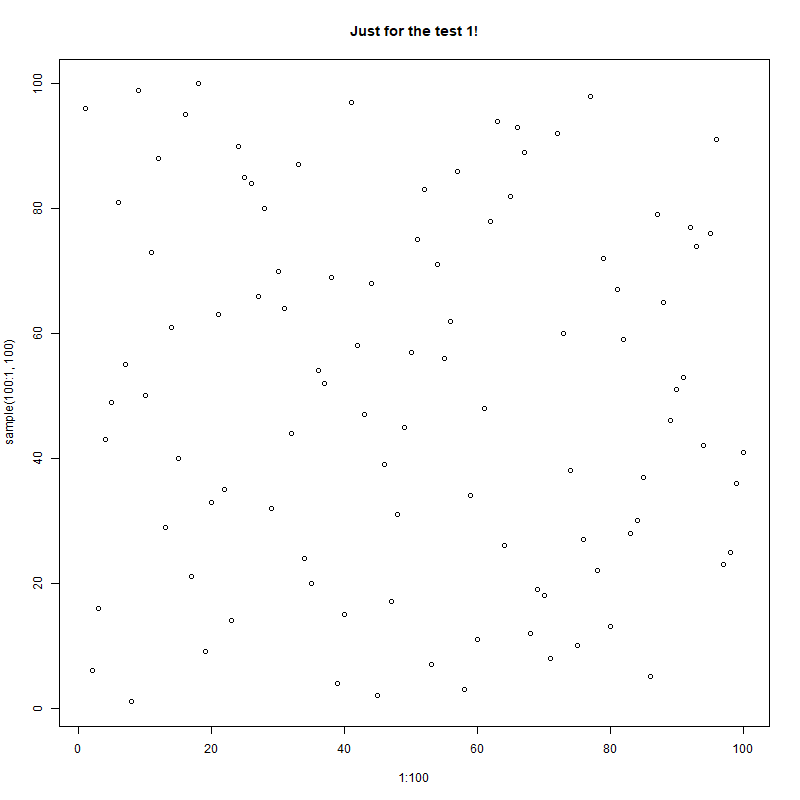

## Heatmap from Saved Selection  1
This selection is available in the R object as group User.group.1

### Genes
[2210016L21Rik](https://www.genecards.org/cgi-bin/carddisp.pl?gene=2210016L21Rik){target='blank'}
 [Acap1](https://www.genecards.org/cgi-bin/carddisp.pl?gene=Acap1){target='blank'}
 [Adgrg1](https://www.genecards.org/cgi-bin/carddisp.pl?gene=Adgrg1){target='blank'}
 [Adgrl4](https://www.genecards.org/cgi-bin/carddisp.pl?gene=Adgrl4){target='blank'}
 [Angpt1](https://www.genecards.org/cgi-bin/carddisp.pl?gene=Angpt1){target='blank'}
 [Arhgdib](https://www.genecards.org/cgi-bin/carddisp.pl?gene=Arhgdib){target='blank'}
 [Arl6ip1](https://www.genecards.org/cgi-bin/carddisp.pl?gene=Arl6ip1){target='blank'}
 [Atp5a1](https://www.genecards.org/cgi-bin/carddisp.pl?gene=Atp5a1){target='blank'}
 [Atp5b](https://www.genecards.org/cgi-bin/carddisp.pl?gene=Atp5b){target='blank'}
 [Atp5f1](https://www.genecards.org/cgi-bin/carddisp.pl?gene=Atp5f1){target='blank'}
 [Atp5g1](https://www.genecards.org/cgi-bin/carddisp.pl?gene=Atp5g1){target='blank'}
 [Atp5g3](https://www.genecards.org/cgi-bin/carddisp.pl?gene=Atp5g3){target='blank'}
 [Atpif1](https://www.genecards.org/cgi-bin/carddisp.pl?gene=Atpif1){target='blank'}
 [AW112010](https://www.genecards.org/cgi-bin/carddisp.pl?gene=AW112010){target='blank'}
 [B2m](https://www.genecards.org/cgi-bin/carddisp.pl?gene=B2m){target='blank'}
 [Baz2b](https://www.genecards.org/cgi-bin/carddisp.pl?gene=Baz2b){target='blank'}
 [Bin2](https://www.genecards.org/cgi-bin/carddisp.pl?gene=Bin2){target='blank'}
 [Bsg](https://www.genecards.org/cgi-bin/carddisp.pl?gene=Bsg){target='blank'}
 [Bzw1](https://www.genecards.org/cgi-bin/carddisp.pl?gene=Bzw1){target='blank'}
 [C1qbp](https://www.genecards.org/cgi-bin/carddisp.pl?gene=C1qbp){target='blank'}
 [Cacybp](https://www.genecards.org/cgi-bin/carddisp.pl?gene=Cacybp){target='blank'}
 [Calr](https://www.genecards.org/cgi-bin/carddisp.pl?gene=Calr){target='blank'}
 [Canx](https://www.genecards.org/cgi-bin/carddisp.pl?gene=Canx){target='blank'}
 [Capg](https://www.genecards.org/cgi-bin/carddisp.pl?gene=Capg){target='blank'}
 [Car1](https://www.genecards.org/cgi-bin/carddisp.pl?gene=Car1){target='blank'}
 [Car2](https://www.genecards.org/cgi-bin/carddisp.pl?gene=Car2){target='blank'}
 [Ccnd3](https://www.genecards.org/cgi-bin/carddisp.pl?gene=Ccnd3){target='blank'}
 [Cct2](https://www.genecards.org/cgi-bin/carddisp.pl?gene=Cct2){target='blank'}
 [Cct3](https://www.genecards.org/cgi-bin/carddisp.pl?gene=Cct3){target='blank'}
 [Cct4](https://www.genecards.org/cgi-bin/carddisp.pl?gene=Cct4){target='blank'}
 [Cct5](https://www.genecards.org/cgi-bin/carddisp.pl?gene=Cct5){target='blank'}
 [Cct6a](https://www.genecards.org/cgi-bin/carddisp.pl?gene=Cct6a){target='blank'}
 [Cct7](https://www.genecards.org/cgi-bin/carddisp.pl?gene=Cct7){target='blank'}
 [Cct8](https://www.genecards.org/cgi-bin/carddisp.pl?gene=Cct8){target='blank'}
 [Cd24a](https://www.genecards.org/cgi-bin/carddisp.pl?gene=Cd24a){target='blank'}
 [Cd27](https://www.genecards.org/cgi-bin/carddisp.pl?gene=Cd27){target='blank'}
 [Cd34](https://www.genecards.org/cgi-bin/carddisp.pl?gene=Cd34){target='blank'}
 [Cd44](https://www.genecards.org/cgi-bin/carddisp.pl?gene=Cd44){target='blank'}
 [Cd63](https://www.genecards.org/cgi-bin/carddisp.pl?gene=Cd63){target='blank'}
 [Cd63-ps](https://www.genecards.org/cgi-bin/carddisp.pl?gene=Cd63-ps){target='blank'}
 [Cd81](https://www.genecards.org/cgi-bin/carddisp.pl?gene=Cd81){target='blank'}
 [Cdk6](https://www.genecards.org/cgi-bin/carddisp.pl?gene=Cdk6){target='blank'}
 [Chchd2](https://www.genecards.org/cgi-bin/carddisp.pl?gene=Chchd2){target='blank'}
 [Coro1a](https://www.genecards.org/cgi-bin/carddisp.pl?gene=Coro1a){target='blank'}
 [Coro7](https://www.genecards.org/cgi-bin/carddisp.pl?gene=Coro7){target='blank'}
 [Cox4i1](https://www.genecards.org/cgi-bin/carddisp.pl?gene=Cox4i1){target='blank'}
 [Cox6a1](https://www.genecards.org/cgi-bin/carddisp.pl?gene=Cox6a1){target='blank'}
 [Cox6b1](https://www.genecards.org/cgi-bin/carddisp.pl?gene=Cox6b1){target='blank'}
 [Cox7a2](https://www.genecards.org/cgi-bin/carddisp.pl?gene=Cox7a2){target='blank'}
 [Cox7b](https://www.genecards.org/cgi-bin/carddisp.pl?gene=Cox7b){target='blank'}
 [Creg1](https://www.genecards.org/cgi-bin/carddisp.pl?gene=Creg1){target='blank'}
 [Crip1](https://www.genecards.org/cgi-bin/carddisp.pl?gene=Crip1){target='blank'}
 [Crlf3](https://www.genecards.org/cgi-bin/carddisp.pl?gene=Crlf3){target='blank'}
 [Cst3](https://www.genecards.org/cgi-bin/carddisp.pl?gene=Cst3){target='blank'}
 [Ctla2a](https://www.genecards.org/cgi-bin/carddisp.pl?gene=Ctla2a){target='blank'}
 [Ctsb](https://www.genecards.org/cgi-bin/carddisp.pl?gene=Ctsb){target='blank'}
 [Ctsd](https://www.genecards.org/cgi-bin/carddisp.pl?gene=Ctsd){target='blank'}
 [Cyc1](https://www.genecards.org/cgi-bin/carddisp.pl?gene=Cyc1){target='blank'}
 [Dapp1](https://www.genecards.org/cgi-bin/carddisp.pl?gene=Dapp1){target='blank'}
 [Dars](https://www.genecards.org/cgi-bin/carddisp.pl?gene=Dars){target='blank'}
 [Ddost](https://www.genecards.org/cgi-bin/carddisp.pl?gene=Ddost){target='blank'}
 [Dek](https://www.genecards.org/cgi-bin/carddisp.pl?gene=Dek){target='blank'}
 [Dkc1](https://www.genecards.org/cgi-bin/carddisp.pl?gene=Dkc1){target='blank'}
 [Dut](https://www.genecards.org/cgi-bin/carddisp.pl?gene=Dut){target='blank'}
 [Dynll1](https://www.genecards.org/cgi-bin/carddisp.pl?gene=Dynll1){target='blank'}
 [Ebf1](https://www.genecards.org/cgi-bin/carddisp.pl?gene=Ebf1){target='blank'}
 [Eif3a](https://www.genecards.org/cgi-bin/carddisp.pl?gene=Eif3a){target='blank'}
 [Eif3g](https://www.genecards.org/cgi-bin/carddisp.pl?gene=Eif3g){target='blank'}
 [Eif5a](https://www.genecards.org/cgi-bin/carddisp.pl?gene=Eif5a){target='blank'}
 [Elf1](https://www.genecards.org/cgi-bin/carddisp.pl?gene=Elf1){target='blank'}
 [Elmo1](https://www.genecards.org/cgi-bin/carddisp.pl?gene=Elmo1){target='blank'}
 [Emb](https://www.genecards.org/cgi-bin/carddisp.pl?gene=Emb){target='blank'}
 [Eng](https://www.genecards.org/cgi-bin/carddisp.pl?gene=Eng){target='blank'}
 [Erp29](https://www.genecards.org/cgi-bin/carddisp.pl?gene=Erp29){target='blank'}
 [Fam107b](https://www.genecards.org/cgi-bin/carddisp.pl?gene=Fam107b){target='blank'}
 [Fam65b](https://www.genecards.org/cgi-bin/carddisp.pl?gene=Fam65b){target='blank'}
 [Fbxo3](https://www.genecards.org/cgi-bin/carddisp.pl?gene=Fbxo3){target='blank'}
 [Fkbp1a](https://www.genecards.org/cgi-bin/carddisp.pl?gene=Fkbp1a){target='blank'}
 [Fkbp4](https://www.genecards.org/cgi-bin/carddisp.pl?gene=Fkbp4){target='blank'}
 [Fth1](https://www.genecards.org/cgi-bin/carddisp.pl?gene=Fth1){target='blank'}
 [Gcnt2](https://www.genecards.org/cgi-bin/carddisp.pl?gene=Gcnt2){target='blank'}
 [Gimap6](https://www.genecards.org/cgi-bin/carddisp.pl?gene=Gimap6){target='blank'}
 [Gm10039](https://www.genecards.org/cgi-bin/carddisp.pl?gene=Gm10039){target='blank'}
 [Gm12346](https://www.genecards.org/cgi-bin/carddisp.pl?gene=Gm12346){target='blank'}
 [Gm13461](https://www.genecards.org/cgi-bin/carddisp.pl?gene=Gm13461){target='blank'}
 [Gm15564](https://www.genecards.org/cgi-bin/carddisp.pl?gene=Gm15564){target='blank'}
 [Gm26917](https://www.genecards.org/cgi-bin/carddisp.pl?gene=Gm26917){target='blank'}
 [Gm2a](https://www.genecards.org/cgi-bin/carddisp.pl?gene=Gm2a){target='blank'}
 [Gm8203](https://www.genecards.org/cgi-bin/carddisp.pl?gene=Gm8203){target='blank'}
 [Gnl3](https://www.genecards.org/cgi-bin/carddisp.pl?gene=Gnl3){target='blank'}
 [Gpr171](https://www.genecards.org/cgi-bin/carddisp.pl?gene=Gpr171){target='blank'}
 [Gpx1](https://www.genecards.org/cgi-bin/carddisp.pl?gene=Gpx1){target='blank'}
 [Gstm1](https://www.genecards.org/cgi-bin/carddisp.pl?gene=Gstm1){target='blank'}
 [H2-DMa](https://www.genecards.org/cgi-bin/carddisp.pl?gene=H2-DMa){target='blank'}
 [H2-Q6](https://www.genecards.org/cgi-bin/carddisp.pl?gene=H2-Q6){target='blank'}
 [H2-Q7](https://www.genecards.org/cgi-bin/carddisp.pl?gene=H2-Q7){target='blank'}
 [H2afy](https://www.genecards.org/cgi-bin/carddisp.pl?gene=H2afy){target='blank'}
 [Hcls1](https://www.genecards.org/cgi-bin/carddisp.pl?gene=Hcls1){target='blank'}
 [Hdgf](https://www.genecards.org/cgi-bin/carddisp.pl?gene=Hdgf){target='blank'}
 [Hlf](https://www.genecards.org/cgi-bin/carddisp.pl?gene=Hlf){target='blank'}
 [Hmgb2](https://www.genecards.org/cgi-bin/carddisp.pl?gene=Hmgb2){target='blank'}
 [Hnrnpab](https://www.genecards.org/cgi-bin/carddisp.pl?gene=Hnrnpab){target='blank'}
 [Hnrnpdl](https://www.genecards.org/cgi-bin/carddisp.pl?gene=Hnrnpdl){target='blank'}
 [Hsp90aa1](https://www.genecards.org/cgi-bin/carddisp.pl?gene=Hsp90aa1){target='blank'}
 [Hsp90b1](https://www.genecards.org/cgi-bin/carddisp.pl?gene=Hsp90b1){target='blank'}
 [Hspa5](https://www.genecards.org/cgi-bin/carddisp.pl?gene=Hspa5){target='blank'}
 [Hspa8](https://www.genecards.org/cgi-bin/carddisp.pl?gene=Hspa8){target='blank'}
 [Hspa9](https://www.genecards.org/cgi-bin/carddisp.pl?gene=Hspa9){target='blank'}
 [Hspd1](https://www.genecards.org/cgi-bin/carddisp.pl?gene=Hspd1){target='blank'}
 [Hspe1](https://www.genecards.org/cgi-bin/carddisp.pl?gene=Hspe1){target='blank'}
 [Ifi203](https://www.genecards.org/cgi-bin/carddisp.pl?gene=Ifi203){target='blank'}
 [Ifi27](https://www.genecards.org/cgi-bin/carddisp.pl?gene=Ifi27){target='blank'}
 [Ifitm1](https://www.genecards.org/cgi-bin/carddisp.pl?gene=Ifitm1){target='blank'}
 [Ifitm3](https://www.genecards.org/cgi-bin/carddisp.pl?gene=Ifitm3){target='blank'}
 [Ifngr1](https://www.genecards.org/cgi-bin/carddisp.pl?gene=Ifngr1){target='blank'}
 [Igfbp4](https://www.genecards.org/cgi-bin/carddisp.pl?gene=Igfbp4){target='blank'}
 [Ikzf1](https://www.genecards.org/cgi-bin/carddisp.pl?gene=Ikzf1){target='blank'}
 [Jak1](https://www.genecards.org/cgi-bin/carddisp.pl?gene=Jak1){target='blank'}
 [Kcnq1ot1](https://www.genecards.org/cgi-bin/carddisp.pl?gene=Kcnq1ot1){target='blank'}
 [Kit](https://www.genecards.org/cgi-bin/carddisp.pl?gene=Kit){target='blank'}
 [Lamp2](https://www.genecards.org/cgi-bin/carddisp.pl?gene=Lamp2){target='blank'}
 [Laptm5](https://www.genecards.org/cgi-bin/carddisp.pl?gene=Laptm5){target='blank'}
 [Lars2](https://www.genecards.org/cgi-bin/carddisp.pl?gene=Lars2){target='blank'}
 [Lcp1](https://www.genecards.org/cgi-bin/carddisp.pl?gene=Lcp1){target='blank'}
 [Ldha](https://www.genecards.org/cgi-bin/carddisp.pl?gene=Ldha){target='blank'}
 [Lgals3bp](https://www.genecards.org/cgi-bin/carddisp.pl?gene=Lgals3bp){target='blank'}
 [Lgals9](https://www.genecards.org/cgi-bin/carddisp.pl?gene=Lgals9){target='blank'}
 [Limd2](https://www.genecards.org/cgi-bin/carddisp.pl?gene=Limd2){target='blank'}
 [Lsp1](https://www.genecards.org/cgi-bin/carddisp.pl?gene=Lsp1){target='blank'}
 [Ly6a](https://www.genecards.org/cgi-bin/carddisp.pl?gene=Ly6a){target='blank'}
 [Ly6e](https://www.genecards.org/cgi-bin/carddisp.pl?gene=Ly6e){target='blank'}
 [Lyz2](https://www.genecards.org/cgi-bin/carddisp.pl?gene=Lyz2){target='blank'}
 [Malat1](https://www.genecards.org/cgi-bin/carddisp.pl?gene=Malat1){target='blank'}
 [Mat2a](https://www.genecards.org/cgi-bin/carddisp.pl?gene=Mat2a){target='blank'}
 [Mcm6](https://www.genecards.org/cgi-bin/carddisp.pl?gene=Mcm6){target='blank'}
 [Mdh2](https://www.genecards.org/cgi-bin/carddisp.pl?gene=Mdh2){target='blank'}
 [Mef2c](https://www.genecards.org/cgi-bin/carddisp.pl?gene=Mef2c){target='blank'}
 [Meis1](https://www.genecards.org/cgi-bin/carddisp.pl?gene=Meis1){target='blank'}
 [Metap2](https://www.genecards.org/cgi-bin/carddisp.pl?gene=Metap2){target='blank'}
 [Mir6236](https://www.genecards.org/cgi-bin/carddisp.pl?gene=Mir6236){target='blank'}
 [Mir6240](https://www.genecards.org/cgi-bin/carddisp.pl?gene=Mir6240){target='blank'}
 [Mndal](https://www.genecards.org/cgi-bin/carddisp.pl?gene=Mndal){target='blank'}
 [Morf4l2](https://www.genecards.org/cgi-bin/carddisp.pl?gene=Morf4l2){target='blank'}
 [Mpl](https://www.genecards.org/cgi-bin/carddisp.pl?gene=Mpl){target='blank'}
 [Mpo](https://www.genecards.org/cgi-bin/carddisp.pl?gene=Mpo){target='blank'}
 [Msn](https://www.genecards.org/cgi-bin/carddisp.pl?gene=Msn){target='blank'}
 [Myb](https://www.genecards.org/cgi-bin/carddisp.pl?gene=Myb){target='blank'}
 [Myc](https://www.genecards.org/cgi-bin/carddisp.pl?gene=Myc){target='blank'}
 [Napsa](https://www.genecards.org/cgi-bin/carddisp.pl?gene=Napsa){target='blank'}
 [Ncl](https://www.genecards.org/cgi-bin/carddisp.pl?gene=Ncl){target='blank'}
 [Ndufb9](https://www.genecards.org/cgi-bin/carddisp.pl?gene=Ndufb9){target='blank'}
 [Nfe2](https://www.genecards.org/cgi-bin/carddisp.pl?gene=Nfe2){target='blank'}
 [Nfkb1](https://www.genecards.org/cgi-bin/carddisp.pl?gene=Nfkb1){target='blank'}
 [Nhp2](https://www.genecards.org/cgi-bin/carddisp.pl?gene=Nhp2){target='blank'}
 [Npm1](https://www.genecards.org/cgi-bin/carddisp.pl?gene=Npm1){target='blank'}
 [P4hb](https://www.genecards.org/cgi-bin/carddisp.pl?gene=P4hb){target='blank'}
 [Pa2g4](https://www.genecards.org/cgi-bin/carddisp.pl?gene=Pa2g4){target='blank'}
 [Pcna](https://www.genecards.org/cgi-bin/carddisp.pl?gene=Pcna){target='blank'}
 [Pdcd4](https://www.genecards.org/cgi-bin/carddisp.pl?gene=Pdcd4){target='blank'}
 [Pde4b](https://www.genecards.org/cgi-bin/carddisp.pl?gene=Pde4b){target='blank'}
 [Pdia3](https://www.genecards.org/cgi-bin/carddisp.pl?gene=Pdia3){target='blank'}
 [Pdia6](https://www.genecards.org/cgi-bin/carddisp.pl?gene=Pdia6){target='blank'}
 [Phb2](https://www.genecards.org/cgi-bin/carddisp.pl?gene=Phb2){target='blank'}
 [Pik3ip1](https://www.genecards.org/cgi-bin/carddisp.pl?gene=Pik3ip1){target='blank'}
 [Pkm](https://www.genecards.org/cgi-bin/carddisp.pl?gene=Pkm){target='blank'}
 [Plac8](https://www.genecards.org/cgi-bin/carddisp.pl?gene=Plac8){target='blank'}
 [Prdx2](https://www.genecards.org/cgi-bin/carddisp.pl?gene=Prdx2){target='blank'}
 [Prdx6](https://www.genecards.org/cgi-bin/carddisp.pl?gene=Prdx6){target='blank'}
 [Prtn3](https://www.genecards.org/cgi-bin/carddisp.pl?gene=Prtn3){target='blank'}
 [Psap](https://www.genecards.org/cgi-bin/carddisp.pl?gene=Psap){target='blank'}
 [Psmc4](https://www.genecards.org/cgi-bin/carddisp.pl?gene=Psmc4){target='blank'}
 [Psmd7](https://www.genecards.org/cgi-bin/carddisp.pl?gene=Psmd7){target='blank'}
 [Ptp4a3](https://www.genecards.org/cgi-bin/carddisp.pl?gene=Ptp4a3){target='blank'}
 [Ptpn6](https://www.genecards.org/cgi-bin/carddisp.pl?gene=Ptpn6){target='blank'}
 [Ptprc](https://www.genecards.org/cgi-bin/carddisp.pl?gene=Ptprc){target='blank'}
 [Ptpre](https://www.genecards.org/cgi-bin/carddisp.pl?gene=Ptpre){target='blank'}
 [Rab38](https://www.genecards.org/cgi-bin/carddisp.pl?gene=Rab38){target='blank'}
 [Ramp1](https://www.genecards.org/cgi-bin/carddisp.pl?gene=Ramp1){target='blank'}
 [Ran](https://www.genecards.org/cgi-bin/carddisp.pl?gene=Ran){target='blank'}
 [Ranbp1](https://www.genecards.org/cgi-bin/carddisp.pl?gene=Ranbp1){target='blank'}
 [Rap1b](https://www.genecards.org/cgi-bin/carddisp.pl?gene=Rap1b){target='blank'}
 [Rgs18](https://www.genecards.org/cgi-bin/carddisp.pl?gene=Rgs18){target='blank'}
 [Rgs19](https://www.genecards.org/cgi-bin/carddisp.pl?gene=Rgs19){target='blank'}
 [Rnf128](https://www.genecards.org/cgi-bin/carddisp.pl?gene=Rnf128){target='blank'}
 [Rpl41](https://www.genecards.org/cgi-bin/carddisp.pl?gene=Rpl41){target='blank'}
 [Rpn1](https://www.genecards.org/cgi-bin/carddisp.pl?gene=Rpn1){target='blank'}
 [Rpn2](https://www.genecards.org/cgi-bin/carddisp.pl?gene=Rpn2){target='blank'}
 [Rps27l](https://www.genecards.org/cgi-bin/carddisp.pl?gene=Rps27l){target='blank'}
 [Rsrp1](https://www.genecards.org/cgi-bin/carddisp.pl?gene=Rsrp1){target='blank'}
 [S100a10](https://www.genecards.org/cgi-bin/carddisp.pl?gene=S100a10){target='blank'}
 [Samsn1](https://www.genecards.org/cgi-bin/carddisp.pl?gene=Samsn1){target='blank'}
 [Saraf](https://www.genecards.org/cgi-bin/carddisp.pl?gene=Saraf){target='blank'}
 [Sdha](https://www.genecards.org/cgi-bin/carddisp.pl?gene=Sdha){target='blank'}
 [Selplg](https://www.genecards.org/cgi-bin/carddisp.pl?gene=Selplg){target='blank'}
 [Sepp1](https://www.genecards.org/cgi-bin/carddisp.pl?gene=Sepp1){target='blank'}
 [Serp1](https://www.genecards.org/cgi-bin/carddisp.pl?gene=Serp1){target='blank'}
 [Shisa5](https://www.genecards.org/cgi-bin/carddisp.pl?gene=Shisa5){target='blank'}
 [Slc25a3](https://www.genecards.org/cgi-bin/carddisp.pl?gene=Slc25a3){target='blank'}
 [Slc25a5](https://www.genecards.org/cgi-bin/carddisp.pl?gene=Slc25a5){target='blank'}
 [Slc34a2](https://www.genecards.org/cgi-bin/carddisp.pl?gene=Slc34a2){target='blank'}
 [Smc4](https://www.genecards.org/cgi-bin/carddisp.pl?gene=Smc4){target='blank'}
 [Snrpb](https://www.genecards.org/cgi-bin/carddisp.pl?gene=Snrpb){target='blank'}
 [Sod1](https://www.genecards.org/cgi-bin/carddisp.pl?gene=Sod1){target='blank'}
 [Spi1](https://www.genecards.org/cgi-bin/carddisp.pl?gene=Spi1){target='blank'}
 [Sqstm1](https://www.genecards.org/cgi-bin/carddisp.pl?gene=Sqstm1){target='blank'}
 [Srsf1](https://www.genecards.org/cgi-bin/carddisp.pl?gene=Srsf1){target='blank'}
 [Ssh2](https://www.genecards.org/cgi-bin/carddisp.pl?gene=Ssh2){target='blank'}
 [Ssr1](https://www.genecards.org/cgi-bin/carddisp.pl?gene=Ssr1){target='blank'}
 [Ssr2](https://www.genecards.org/cgi-bin/carddisp.pl?gene=Ssr2){target='blank'}
 [Stt3a](https://www.genecards.org/cgi-bin/carddisp.pl?gene=Stt3a){target='blank'}
 [Sumo3](https://www.genecards.org/cgi-bin/carddisp.pl?gene=Sumo3){target='blank'}
 [Tacc1](https://www.genecards.org/cgi-bin/carddisp.pl?gene=Tacc1){target='blank'}
 [Taldo1](https://www.genecards.org/cgi-bin/carddisp.pl?gene=Taldo1){target='blank'}
 [Tcp1](https://www.genecards.org/cgi-bin/carddisp.pl?gene=Tcp1){target='blank'}
 [Tgtp2](https://www.genecards.org/cgi-bin/carddisp.pl?gene=Tgtp2){target='blank'}
 [Tmem128](https://www.genecards.org/cgi-bin/carddisp.pl?gene=Tmem128){target='blank'}
 [Tmem14c](https://www.genecards.org/cgi-bin/carddisp.pl?gene=Tmem14c){target='blank'}
 [Tmem176a](https://www.genecards.org/cgi-bin/carddisp.pl?gene=Tmem176a){target='blank'}
 [Tmem176b](https://www.genecards.org/cgi-bin/carddisp.pl?gene=Tmem176b){target='blank'}
 [Tmsb4x](https://www.genecards.org/cgi-bin/carddisp.pl?gene=Tmsb4x){target='blank'}
 [Tnfaip8](https://www.genecards.org/cgi-bin/carddisp.pl?gene=Tnfaip8){target='blank'}
 [Tsc22d1](https://www.genecards.org/cgi-bin/carddisp.pl?gene=Tsc22d1){target='blank'}
 [Tspan13](https://www.genecards.org/cgi-bin/carddisp.pl?gene=Tspan13){target='blank'}
 [Tspan32](https://www.genecards.org/cgi-bin/carddisp.pl?gene=Tspan32){target='blank'}
 [Tspan8](https://www.genecards.org/cgi-bin/carddisp.pl?gene=Tspan8){target='blank'}
 [Ttc3](https://www.genecards.org/cgi-bin/carddisp.pl?gene=Ttc3){target='blank'}
 [Tuba1b](https://www.genecards.org/cgi-bin/carddisp.pl?gene=Tuba1b){target='blank'}
 [Tuba4a](https://www.genecards.org/cgi-bin/carddisp.pl?gene=Tuba4a){target='blank'}
 [Tubb4b](https://www.genecards.org/cgi-bin/carddisp.pl?gene=Tubb4b){target='blank'}
 [Tubb5](https://www.genecards.org/cgi-bin/carddisp.pl?gene=Tubb5){target='blank'}
 [Txn2](https://www.genecards.org/cgi-bin/carddisp.pl?gene=Txn2){target='blank'}
 [Txnip](https://www.genecards.org/cgi-bin/carddisp.pl?gene=Txnip){target='blank'}
 [Txnl1](https://www.genecards.org/cgi-bin/carddisp.pl?gene=Txnl1){target='blank'}
 [Ucp2](https://www.genecards.org/cgi-bin/carddisp.pl?gene=Ucp2){target='blank'}
 [Uqcr11](https://www.genecards.org/cgi-bin/carddisp.pl?gene=Uqcr11){target='blank'}
 [Uqcrc1](https://www.genecards.org/cgi-bin/carddisp.pl?gene=Uqcrc1){target='blank'}
 [Uqcrfs1](https://www.genecards.org/cgi-bin/carddisp.pl?gene=Uqcrfs1){target='blank'}
 [Vamp5](https://www.genecards.org/cgi-bin/carddisp.pl?gene=Vamp5){target='blank'}
 [Vars](https://www.genecards.org/cgi-bin/carddisp.pl?gene=Vars){target='blank'}
 [Vdac1](https://www.genecards.org/cgi-bin/carddisp.pl?gene=Vdac1){target='blank'}
 [Vdac2](https://www.genecards.org/cgi-bin/carddisp.pl?gene=Vdac2){target='blank'}
 [Vim](https://www.genecards.org/cgi-bin/carddisp.pl?gene=Vim){target='blank'}
 [Wdr1](https://www.genecards.org/cgi-bin/carddisp.pl?gene=Wdr1){target='blank'}
 [Xist](https://www.genecards.org/cgi-bin/carddisp.pl?gene=Xist){target='blank'}
 [Ybx1](https://www.genecards.org/cgi-bin/carddisp.pl?gene=Ybx1){target='blank'}
 [Ypel3](https://www.genecards.org/cgi-bin/carddisp.pl?gene=Ypel3){target='blank'}
 [Zbtb20](https://www.genecards.org/cgi-bin/carddisp.pl?gene=Zbtb20){target='blank'}
 [Zfand5](https://www.genecards.org/cgi-bin/carddisp.pl?gene=Zfand5){target='blank'}
 [Zfp422](https://www.genecards.org/cgi-bin/carddisp.pl?gene=Zfp422){target='blank'}
 [Zyx](https://www.genecards.org/cgi-bin/carddisp.pl?gene=Zyx){target='blank'}

### Heatmap (from CellexalVR)

### 2D DRC DDRtree  dim 1,2

### 2D DRC DDRtree  dim 2,3

The heatmap can be restored in a new VR session using the 2D console (F12) and type:

lsf .

confirm

rsf ../output/tmp/a_simple.txt
